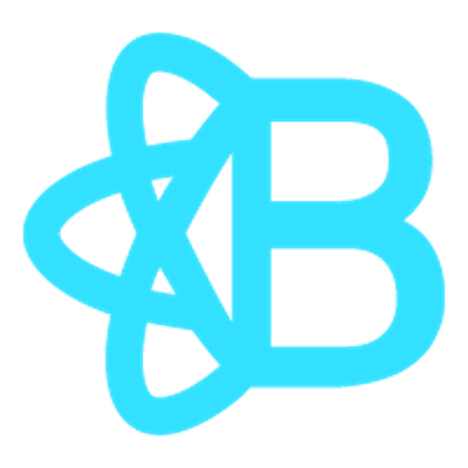
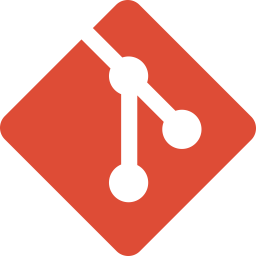

## Hi, I'm Wadim :v:

  

:man_student: **I'm currently studying Web Development at [DCI](https://digitalcareerinstitute.org/).**

:briefcase: **Feel free to check some examples of my code, for instance [Randomizer](https://sempris.github.io/civ_randomizer/), [Kleimann Cafe](https://sempris.github.io/cafe-kleimann/), or [COVID-19 Info](https://covid19-info-sempris.netlify.app/) projects.**

:hearts: **My hobbies are :computer: coding, :video_game: computer games, :game_die: tabletop games, :basketball: basketball, :ping_pong: ping-pong**

## Tools and Frameworks

                  
