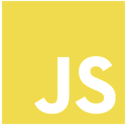

## Hi, I'm Wadim :v:

  

:man_student: **I'm currently studying Web Development at [DCI](https://digitalcareerinstitute.org/).**

:briefcase: **Feel free to check some examples of my code, for instance [Randomizer](https://sempris.github.io/civ_randomizer/) or [Kleimann Cafe](https://sempris.github.io/cafe-kleimann/) projects.**

:hearts: **My hobbies are :computer: programming, :video_game: computer games, :game_die: table top games, :basketball: basketball, :ping_pong: ping-pong**

## Tools and Frameworks

          
